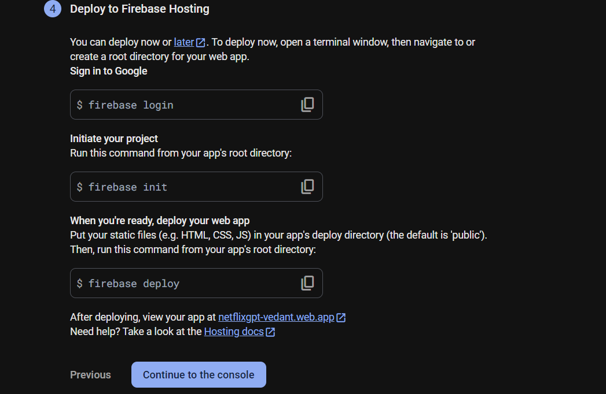
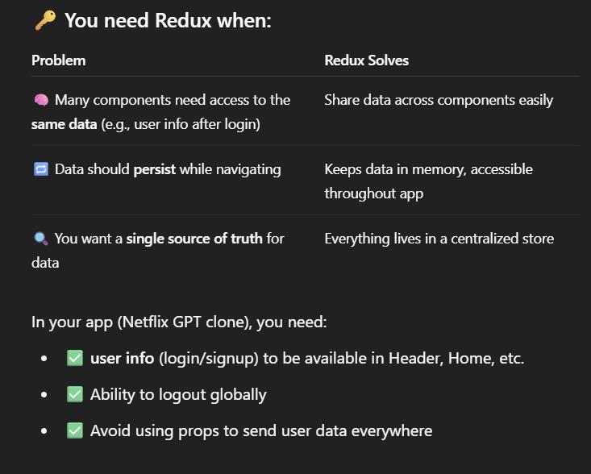

# NetFlix-GPT Project-:

 - Create a Vite app with TailwindCss using TailwindCss docx.
  - [text](https://tailwindcss.com/docs/installation/using-vite)


# Step by Step of Creating NetflixGPT App-:
 - Create Vite App
 - Configure Tailwind
 - Header
 - Routing Of App
 - Login Form
 - Sign Up Form
 - Form Validation
 - useRef Hook -: for Form Validations
 - Authentication -: Google FireBase
 - Deploying App to production
 - Create Sign Up User account
 - Implement Sign in User api
 - Setup Redux Store with userSlice
 - Implemented Sign Out
 - Update Profile
 


---

## Features -:

- Login / SignUp Page-:
  - Sign In / Sign Up form
  - redirect to browse page

  - Sign In -: Email, Password
  - Sign Up -: Name , Email , Password 
  - Build a Sign In and Sign Up form Using Usestate ==> Toggle Feature. if t rue ==> sign In if false ==> Sign Up.

  - If the Very Big Form Is required then use Libray name ====> FORMIK

  - useRef Hooks -: lets you refrence of value that's not needed for rendering
  
  - For Name Validation we use regex-: 
    /^[a-zA-Z ]{2,30}$/.test(name);

  - For Email validation we use Regex
     For Testing-: /^([a-zA-Z0-9._%-]+@[a-zA-Z0-9.-]+\.[a-zA-Z]{2,})$/.test(
    email
  );

  - For Password Validation we use regex-: 
       /^(?=.*\d)(?=.*[a-z])(?=.*[A-Z])(?=.*[a-zA-Z]).{8,}$/.test(password)


---
# Authentication-: Google FireBase with Google Analytics
 - [text](https://console.firebase.google.com)

 - 
 - [text](https://console.firebase.google.com/u/0/project/netflixgpt-vedant/authentication/providers)
 - after successfully signed up (move to) ====> Browse Page 


---
# Redux Store-:
 - Redux is used for global state management, and Redux Toolkit is the modern, simplified way to use Redux.

 - 

 - Storing & sharing user information globally across your app.

 - Redux Toolkit-: 
  ```
  npm i -D @reduxjs/toolkit
  ```

  - React Redux-:
  ```
  npm i react-redux
  ```

  - Create -: 
   1) utils/appStore.js
   2) utils/userSlice.js

  - instead of push user date to everytime we use onAuth state change provided by firebase.
  - Body.jsx ==> appstore.jsx ==> userslice.jsx ==> login.jsx ==> on success => browse page 


- App Starts
│
├── Body.jsx (Main Component)
│   │
│   ├── ✅ useEffect (onAuthStateChanged listens for login/logout)
│   │       ├── If user is logged in → dispatch(addUser)
│   │       └── If user logs out     → dispatch(removeUser)
│   │
│   └── Provides routes using <RouterProvider>
│       │
│       ├── "/"        → BodyContent (default route, not really used here)
│       ├── "/login"   → Login.jsx  ← (user goes here manually or redirected)
│       ├── "/browse"  → Browse.jsx (after successful login/signup)
│       └── "/header"  → Header.jsx
│
├── appstore.jsx
│   └── Creates Redux store with userSlice
│
├── userSlice.jsx
│   ├── addUser() → saves user data in Redux store
│   └── removeUser() → clears user data on logout
│
└── Login.jsx (only when user visits /login)
    │
    ├── Form input (email, password, name for signup)
    ├── validate inputs
    ├── 🔐 Calls Firebase Auth:
    │     ├── createUserWithEmailAndPassword (Sign Up)
    │     └── signInWithEmailAndPassword (Sign In)
    │
    └── On success:
          🔁 Firebase triggers onAuthStateChanged in Body.jsx
          → Redux store updated with addUser()
          → Navigates to "/browse"
   


---
# Browse Page
- Browse Page()-: Only comes after Authentication.-:
   - Header
   - Main Movie
       - Trailer in BackGround
       - Title & Description
       - Movie Suggestions
          - MovieLists * N   (verticle scrollable)

- NetFlixGpt
   - Search Bar
   - Movie Suggestions
            
